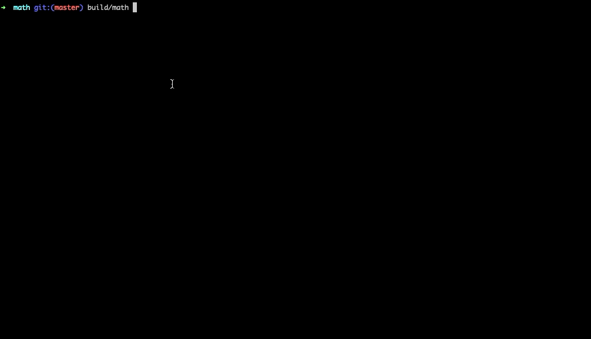

# DART math addition

Простой скрипт для сложения любых чисел с использованием dart.

## Запуск

`build/math`

## Установка

Инструкция - [https://dart.dev/get-dart]

Сборка - `dart2native bin/main.dart -o build/math`

## Использование

